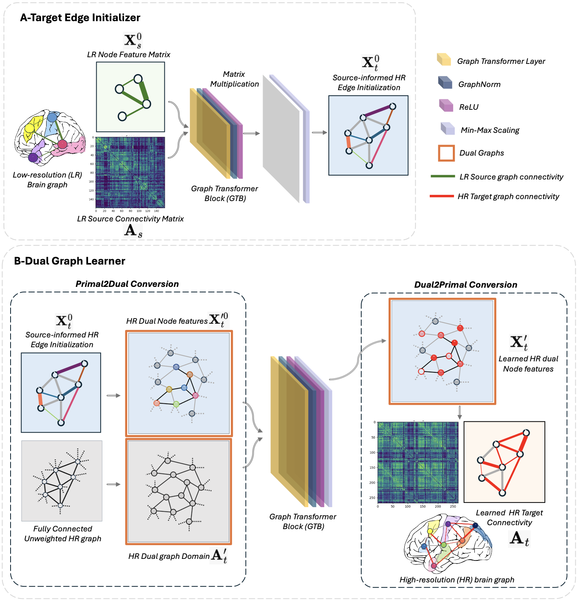

# STP-GSR: Strongly Topology-preserving GNNs for Brain Graph Super-resolution

This repository provides the official implementation of our STP-GSR model accepted to [PRIME-MICCAI-2024](https://basira-lab.com/prime-miccai-2024/).

*Our STP-GSR model reformulates an edge regression task into a node regression task using dual (line) graph construction. This helps our model better preserve topology for brain graph super-resolution which is crucial to correctly identify onset/presence of neurodegenerative diseases like Alzheimer's and Parkinson's.*


## Installation

Step 1: Create a python virtual environment (here, we name it `stp_gsr`):

```
python -m venv stp_gsr
```

Step 2: Install packages:

```
pip install -r requirements.txt
```

## Training and Validation

Our code supports k-fold cross validation. All the training and testing configurations are loaded from `configs/experiment.yaml`. Individual dataset and model specific configurations are stored under `configs/dataset` and `configs/models`, respectively.

To run our model, either change the `.yaml` files and run ```python main.py``` or directly change the configuration from the command line as follows:

```
python main.py dataset='sbm' experiment.n_epochs=30 model='stp_gsr'
```

***What does main.py do?*** Loads given dataset, splits into `k` folds, and initializes, trains and validates model for each fold. It also stores below components for each fold under `results/<model_name>/<dataset_name>/<run_name>/<fold>/`:

1. Final trained model
2. Training loss curve
3. Validation loss curve
4. Source, target, and predicted adjacency matrices for the valdiation data
5. Training evolution by plotting randomly sampled source-target-predicted matrices

## Dataset
We provide code to simulate source-target pairs using four differnet graph generation methods:
1. [Erods-Renyi model](https://en.wikipedia.org/wiki/Erd%C5%91s%E2%80%93R%C3%A9nyi_model) (`er.yaml`)
2. [Barbasi-Albert model](https://en.wikipedia.org/wiki/Barab%C3%A1si%E2%80%93Albert_model) (`ba.yaml`)
3. [Kronecker graph](https://en.wikipedia.org/wiki/Kronecker_graph) (`kronecker.yaml`)
4. [Stochastic Block model](https://en.wikipedia.org/wiki/Stochastic_block_model) (`sbm.yaml`)

## Adding new dataset
Please follow below steps to test our model with a new dataset:

1. Add code to load your source and target matrices in the `load_dataset` function in `src/dataset.py`.
2. Create a `<your_dataset_name>.yaml` file under `configs/dataset` for your dataset. Every `.yaml` file should at-least have three attributes: `name`, `n_source_nodes`, and `n_target_nodes`. Having separate files allow easy handling of dataset specific configurations.
3.  Run ```python main.py dataset=<your_dataset_name>```

## References
TODO

